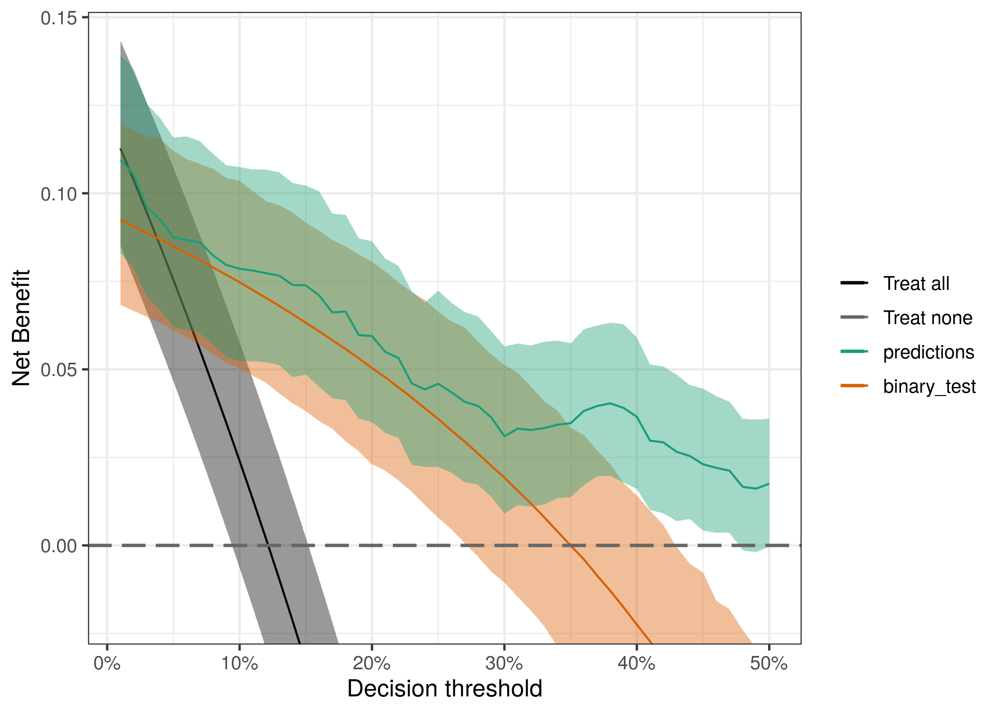
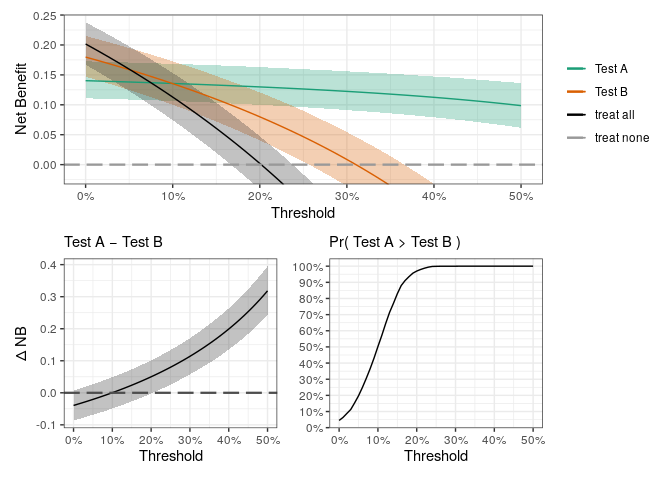
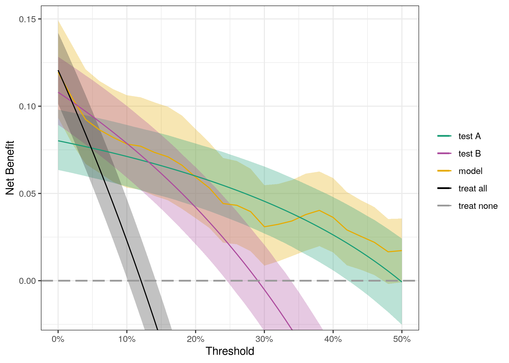
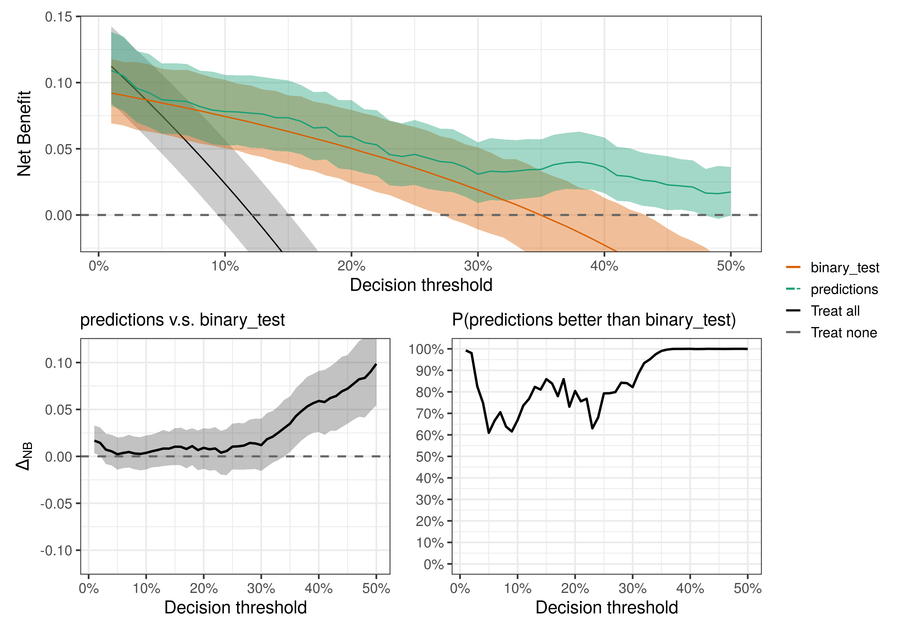

<!-- README.md is generated from README.Rmd. Please edit that file -->

# bayesDCA

<!-- badges: start -->

[](https://lifecycle.r-lib.org/articles/stages.html#experimental)
<!-- badges: end -->

Perform Bayesian Decision Curve Analysis for clinical prediction models
and diagnostic tests.

When validating a clinical prediction model, you may end up with AUC
0.79 and a slight miscalibration. How do you know if that is good enough
for your model to be clinically useful? The same question can be asked
if you have a diagnostic test with sensitivity of 75% and specificity of
68%. Decision Curve Analysis helps us find an answer - see [Vickers, van
Calster & Steyerberg,
2019](https://diagnprognres.biomedcentral.com/articles/10.1186/s41512-019-0064-7)
for an introduction to DCA. Here, we use Bayesian methods to accurately
quantify uncertainty in our decisions curves.

# Installation

You can install the development version of bayesDCA from
[GitHub](https://github.com/) with:

``` r
# install.packages("devtools")
devtools::install_github("giulianonetto/bayesdca")
```

# Examples

You can use `bayesDCA` to evaluate predictive models as well as binary
and continuous tests - either diagnostic or prognostic. All plots are
either [`ggplot2`](https://ggplot2.tidyverse.org/) or
[`patchwork`](https://patchwork.data-imaginist.com/) objects. All
plotting functions have a `data_only` argument with which one can access
raw plotting data.

## Clinical prediction model

For your clinical prediction model (CPM), you only need the patients’
`outcomes` (0 or 1) and the corresponding `predictions` (predicted
probabilities).

``` r
library(bayesDCA)
data(PredModelData)
head(PredModelData)
#>   outcomes predictions
#> 1        0  0.01280653
#> 2        0  0.13981948
#> 3        0  0.03566458
#> 4        0  0.02351731
#> 5        0  0.00863298
#> 6        0  0.00959754
```

``` r
fit <- dca_predictive_model(outcomes = PredModelData$outcomes,
                            predictions = PredModelData$predictions)
plot(fit)
```



## Binary test

If you have a binary test, either diagnostic or prognostic, you just
need to specify the sample size (`N`), the number of diseased patients
or events (`d`), the number of true positives (`tp`), and the number of
true negatives (`tn`).

``` r
library(bayesDCA)
fit <- dca_binary_test(N = 500, d = 83, tp = 77, tn = 378)
plot(fit)
```



## Plotting multiple tests and/or models

You can use `plot_dca_list` to visualize multiple tests or models
simultaneously.

``` r
library(bayesDCA)
# binary tests
fit1 <- dca_binary_test(N = 1000, d = 120, tp = 80, tn = 800)
fit2 <- dca_binary_test(N = 1000, d = 120, tp = 108, tn = 616)
# predictive model
data(PredModelData)
fit3 <- dca_predictive_model(outcomes = PredModelData$outcomes,
                             predictions = PredModelData$predictions)
# plot decision curves
plot_dca_list("test A" = fit1, "test B" = fit2, "model" = fit3)
```



In this example, the predictive model doesn’t seem to add much over the
diagnostic tests for most thresholds, although it might overcome the
tests for very high thresholds (e.g. aove 40%). If the model requires
multiple predictors, then one migh prefer to use simple binary tests -
depending on the application, of course. In that case, one may wonder
which test to pick.

## Compare DCA

If you want to compare the decision curves from two models and/or tests,
you can provide the `fit` objects to the `compare_dca` function.

``` r
library(bayesDCA)
fit1 <- dca_binary_test(N = 1000, d = 120, tp = 80, tn = 800)
fit2 <- dca_binary_test(N = 1000, d = 120, tp = 108, tn = 616)
compare_dca("Test A" = fit1, "Test B" = fit2)
```



## Continuous tests, scores, gene signatures, etc.

[Categorization of continuous predictors is strongly
discouraged](https://www.prognosisresearch.com/videos-categorisation),
and continuous tests are no different. This also applies to prognostic
or diagnostic scores, expression signatures, and all of the like. As
decisions are often categorical, it’s better to categorize outcome
probabilities and then map probability thresholds back to corresponding
test values. You end up with a test cutoff either way, but only one is
clinically motivated - see [Myth
2](https://bmcmedicine.biomedcentral.com/articles/10.1186/s12916-019-1425-3#Sec3)
in [Wynants et al,
2019](https://bmcmedicine.biomedcentral.com/articles/10.1186/s12916-019-1425-3).
This risk stratification procedure can be applied seamlessly by fitting
single-predictor models (e.g. `Disease ~ test_value`). This leads to
clinically-informed test cutoffs as opposed to observed-data
arbitrariness (e.g. categorizing by quantile of the score, which yields
arbitrary risk distributions in the score strata).

Notice that choosing an appropriate risk threshold for your continuous
test properly balances your requirements for sensitivity and specificity
according to the clinical context - the cost of each correct or
incorrect decision. Whereas one may wish to maximize sensitivity and
specificity simultaneously (e.g. pick the “elbow” in a ROC curve), that
procedure effectively assumes that false positives have the same costs
as false negatives, which is usually dramatically incorrect. For
instance, a screening test surely should penalize false negatives way
more heavily than false positives, while for a confirmatory test the
cost of false positives would be more important. Hence, the resulting
test cutoff should be optimized by clinical reasoning, not by
data-driven artifacts.

Once you have your test cutoff, you can compute `tp` and `tn` and
proceed with `dca_binary_test` as usual. Of course, a likely better
approach would be to use your model to take advantage of the
(non-linear) relationship between test values and outcome probability,
but that turns your diagnostic/prognostic test study into a predictive
model study - you would use `dca_predictive_model` in that case.

Future versions of `bayesDCA` should include an easy API for this task.
